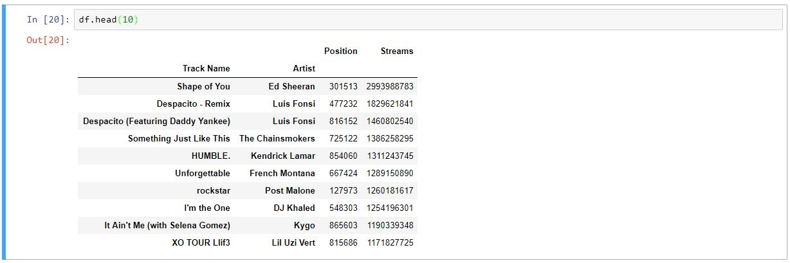
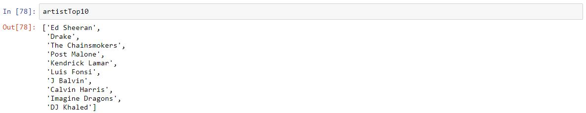
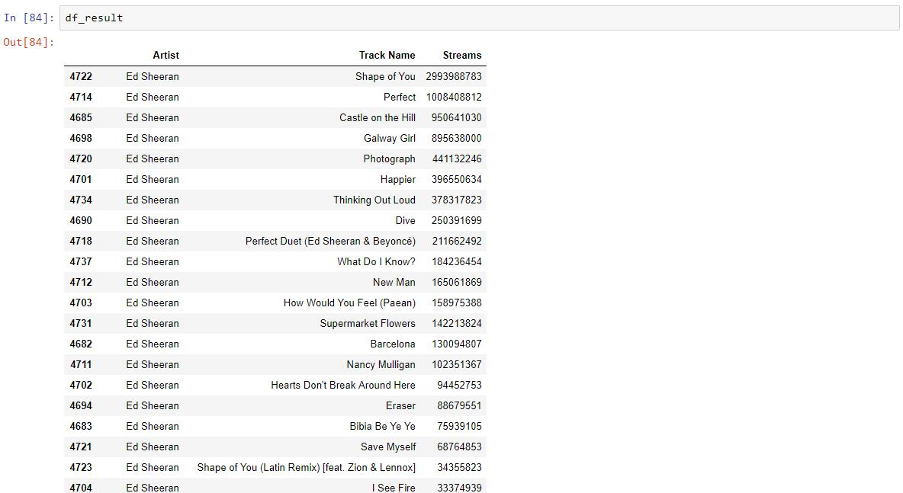
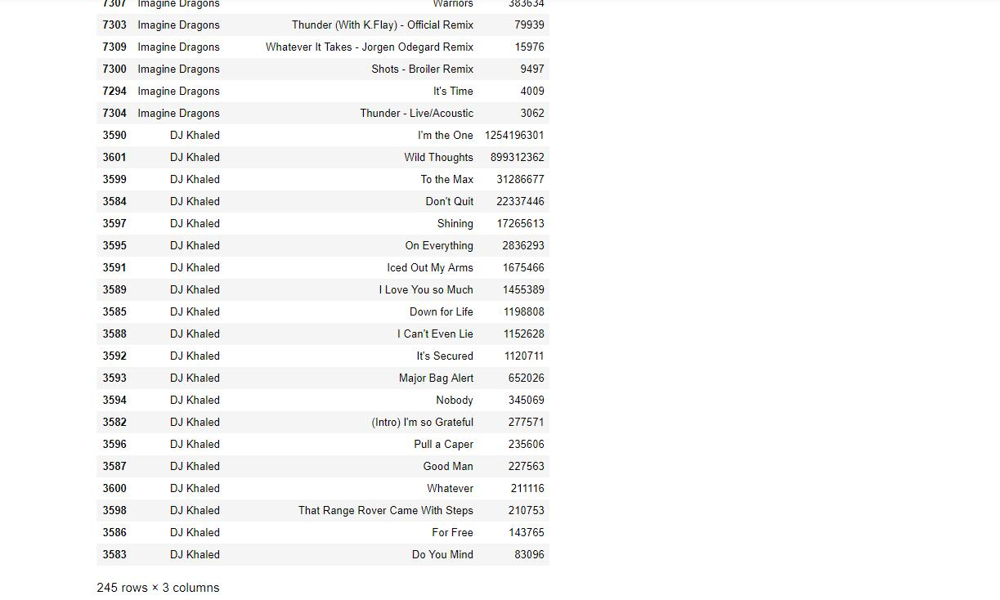
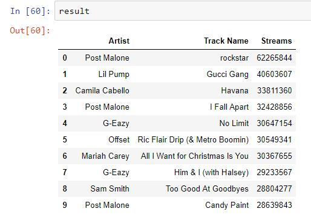
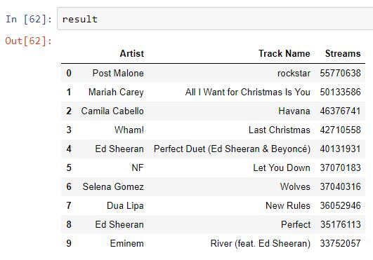
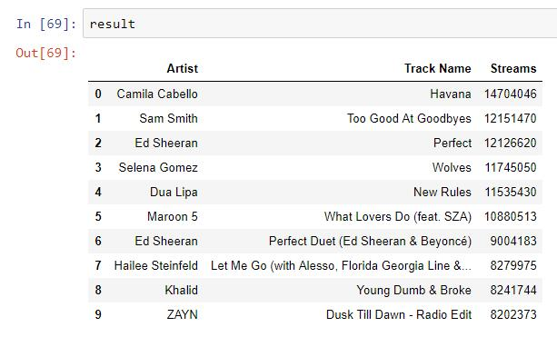
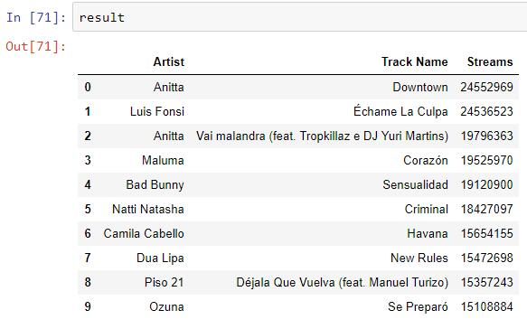
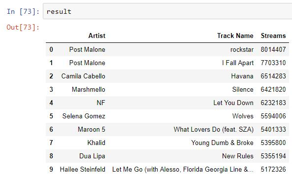
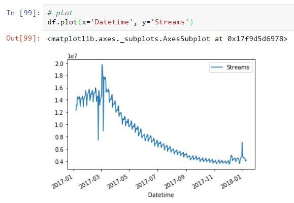

# The Solution of Challenge 4

1. Open jupyter

   I've installed anaconda 3, which contains jupyter. To run jupyter, type the following code:
   ```
   jupyter notebook
   ```
   After jupyter is started, click new -> Python 3.

2. Import pandas
   ```python
   import pandas as pd
   ```

3. Q1: aggregate data
   ```python
   # load data
   df = pd.read_csv('data.csv')
   
   # group data and sum the stream
   df = df.groupby(['Track Name', 'Artist']).sum()
   
   # sort by streams
   df = df.sort_values(by='Streams', ascending=False)
   
   # list the top 10
   df.head(10)
   ```
   The result:
   
   

4. Q2: artists (or groups)
   ```python
   import pandas as pd
   
   # aggregate and sort
   df_0 = pd.read_csv('data.csv')
   df = df_0.groupby('Artist').sum()
   artist = df.sort_values(by='Streams', ascending=False)
   
   # get the top 10 artist list
   artistTop10 = artist.head(10)
   artistTop10 = artistTop10.index.tolist()
   ```
   
   
   ```python
   df = df_0[['Artist', 'Track Name', 'Streams']]
   df = df.groupby(['Artist', 'Track Name']).sum()
   df = df.reset_index()
   
   # filter dataframe with the artist in the top 10 artist list
   df_result = df[df['Artist'].isin(artistTop10)]
   
   # artistTop10 is the sorter
   # create the dictionary that defines the order of sorting
   sorterIndex = dict(zip(artistTop10, range(len(artistTop10))))
   # generate a rank column that will be used to sort the dataframe numerically
   df_result['Artist Rank'] = df_result['Artist'].map(sorterIndex)
   # sort the dataframe
   df_result.sort_values(['Artist Rank', 'Streams'], ascending = [True, False], inplace = True)
   # remove the added column for ranking
   df_result.drop('Artist Rank', 1, inplace = True)
   ```
   
   

5. Q3: list tracks
   ```python
   import pandas as pd
   
   def getTracks(continent):
       df = pd.read_json('countries.json', orient='index')
       
       # get the countries in the appointed continent
       df_countries = df.loc[df['continent'] == continent]
       df_countries = df_countries.reset_index()
       df_countries = df_countries['index'].tolist()
       df_countries = pd.Series(df_countries).str.lower()
       df_countries = df_countries.tolist()
   
       # get the rows in the appointed countries
       df = pd.read_csv('data.csv')
       df = df.loc[df['Region'].isin(df_countries)]
   
       # get the rows in the appointed date
       def getYear(dateString):
           return dateString.split('-')[0]
       def getMonth(dateString):
           return dateString.split('-')[1]
   
       df['Year'] = df['Date'].apply(getYear)
       df['Month'] = df['Date'].apply(getMonth)
       df = df.loc[(df['Year'] == '2017') & (df['Month'] == '12')]
   
       # aggregate data
       df = df.groupby(['Track Name', 'Artist']).sum()
       df = df.sort_values(by='Streams', ascending=False)
       df = df.head(10)
   
       df = df.reset_index()
       df = df[['Artist', 'Track Name', 'Streams']]
       
       return df
   ```
   For "North America":
   ```python
   continent = 'NA'
   result = getTracks(continent)
   ```
   Below is the result:  
   
   
   For "Europe":
   ```python
   continent = 'EU'
   result = getTracks(continent)
   ```
   Below is the result:  
   
   
   For "Asia":
   ```python
   continent = 'AS'
   result = getTracks(continent)
   ```
   Below is the result:  
   
   
   For "South America":
   ```python
   continent = 'SA'
   result = getTracks(continent)
   ```
   Below is the result:  
   
   
   For "Oceania":
   ```python
   continent = 'OC'
   result = getTracks(continent)
   ```
   Below is the result:  
   

6. Q4: plot
   ```python
   import pandas as pd
   
   df = pd.read_csv('data.csv')
   # filter the data with the artist and the track name
   df = df.loc[(df['Artist'] == 'Ed Sheeran') & (df['Track Name'] == 'Shape of You')]
   # aggregrate the data
   df = df.groupby(['Artist', 'Track Name', 'Date']).sum()
   # filter the columns
   df = df.reset_index()
   df = df[['Date', 'Streams']]
   
   # change time string to datetime
   def toDatetime(dateString):
       return pd.to_datetime(dateString, format='%Y-%m-%d')
   
   df['Datetime'] = df['Date'].apply(toDatetime)
   
   # plot
   df.plot(x='Datetime', y='Streams')
   ```
   
   The result:  
   
